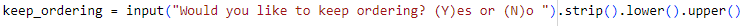

# Interactive Food Truck Ordering System
## Overview

This application is an ordering system that enables the user to place a food order, and to receive an itemized receipt (list of item(s), price per item, total cost) upon order completion.

## Installation:
Menu consists of 4 main categories. Each main category includes sub-categories and prices. Below is the menu selection:

   

## Requirements | Order System

1. An order list is initialized. 
 
   

2. User is prompted for their menu item selection and it's saved as a variable menu_selection.

    
    
    
    
3. User input menu_selection is checked as a number and error is printed if it is not.

    
    
    

 4. menu_selction is converted to an integer.

    
     
  5. An if-else statement is used to check if menu_selection is in the menu_items keys, and an error is printed if it isn't.

     
     
     
  6. The item name of the customer's selection is extracted from the menu_items dictionary and stored as a variable.

      
      
  7. The customer is prompted for a quantity of their item selection and the value defaults to 1 if the customer does not input a valid number.

      
  
   8. The customer's selected item, and quantity are appended to the order list in dictionary format.

      

   9. A match-case statement is used to check if the customer would like to keep ordering, and performs the correct actions for y, n, and default cases.

      

  10. The match-case statement converts the use input to lowercase or uppercase before checking the case.

      

## Requirements | Order Receipt

  1. A for loop is used to loop through the order list.

      

  2. The value of each key in each order dictionary is saved as a variable.

  3. 

## Results
