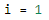
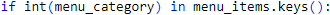
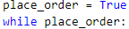

# Interactive Food Truck Ordering System
## Overview

This application is an ordering system that enables the user to place a food order, and to receive an itemized receipt (list of item(s), price per item, total cost) upon order completion.

## Installation:
Menu consists of 4 main categories. Each main category includes sub-categories and prices. Below is the menu selection:

   

## Requirements | Order System

1. An order list is initialized. 
 
   

2. User is prompted for their menu item selection and it's saved as a variable menu_selection.

    
    
    
    
3. User input menu_selection is checked as a number and error is printed if it is not.

    
    
    
   * Launch the store and present a greeting to the customer
     
     

   * Customers may want to order multiple items, so let's create a continuous loop

      

   * Ask the customer from which menu category they want to order

       
  
   
  
     
## Results
