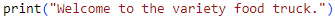

# Interactive Food Truck Ordering System
## Overview

This application is an ordering system that enables the user to place a food order, and to receive an itemized receipt (list of item(s), price per item, total cost) upon order completion.

## Menu consists of 4 main categories. Each main category includes sub-categories and prices: 

   

## Step by Step

1. Set up order list. Order list will store a list of dictionaries for # menu item name, item price, and quantity ordered
 
   
   
   * Launch the store and present a greeting to the customer
     
     

   * Customers may want to order multiple items, so let's create a continuous loop
  
     
## Results
