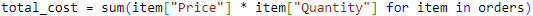

# Interactive Food Truck Ordering System
## Overview

This application is an ordering system that enables the user to place a food order, and to receive an itemized receipt (list of item(s), price per item, total cost) upon order completion.

## Description:

Menu consists of 4 main categories. Each main category includes sub-categories and prices. Below is the menu selection:

   

Listed below is a step by step of the written code based on the requested requirements.

## Requirements | Order System

1. An order list is initialized. 
 
   

2. User is prompted for their menu item selection and it's saved as a variable menu_selection.

    
    
3. User input menu_selection is checked as a number and error is printed if it is not.

    
    

 4. menu_selction is converted to an integer.

    
     
  5. An if-else statement is used to check if menu_selection is in the menu_items keys, and an error is printed if it isn't.

     
     
     
  6. The item name of the customer's selection is extracted from the menu_items dictionary and stored as a variable.

      
      
  7. The customer is prompted for a quantity of their item selection and the value defaults to 1 if the customer does not input a valid number.

      
  
   8. The customer's selected item, and quantity are appended to the order list in dictionary format.

      

   9. A match-case statement is used to check if the customer would like to keep ordering, and performs the correct actions for y, n, and default cases.

      

  10. The match-case statement converts the use input to lowercase or uppercase before checking the case.

      

## Requirements | Order Receipt

  1. A for loop is used to loop through the order list.

      

  2. The value of each key in each order dictionary is saved as a variable.

      

  3. The number of formatting spaces are correctly calculated.

      

  4. Space strings are created using string multiplication.

      
      
  5. The customer's order is printed with item name, price, and quantity.
     
      

  6. List comprehension is used to calculate the total price of the order.

      

  7. The total price of the order is printed to the screen.

      

      
## Summary

* Initiate the ordering sequence by clicking the ‘run’ button in a Python-compatible source code editor. The program will greet the user with a warm welcome to “The Variety Food Truck”. 
* The user will be prompted to choose from 4 menu categories. Should the user enter a number outside this range, the system will indicate the selected number is not a valid number, and the user will be asked if they wish to keep ordering. 
* If the user types (Y) or (y) the system will display the 4 menu categories again. Once the user selects a menu category between numbers 1-4 the system will display the sub categories, and the user will be prompted to select the item and quantity.
* The system will then inquire if the user would like to keep ordering. If the user selects (Y) or (y) the system will circle to the beginning of the application, greeting the user, and asking them to select a menu category (1-4). 
* Once the user ends their order by typing (N) or (n) the system will conclude the order, print a receipt that includes a "Thank you for your order!" message, followed by an itemized receipt which includes the selected menu item(s), price, and the total cost.

## Source Code:
* I worked on my code with a tutor through tutoring session
* I worked on my code with a private tutor through Wyzant.com
* I worked on my code with the assistance of bing.com/Copilot 
